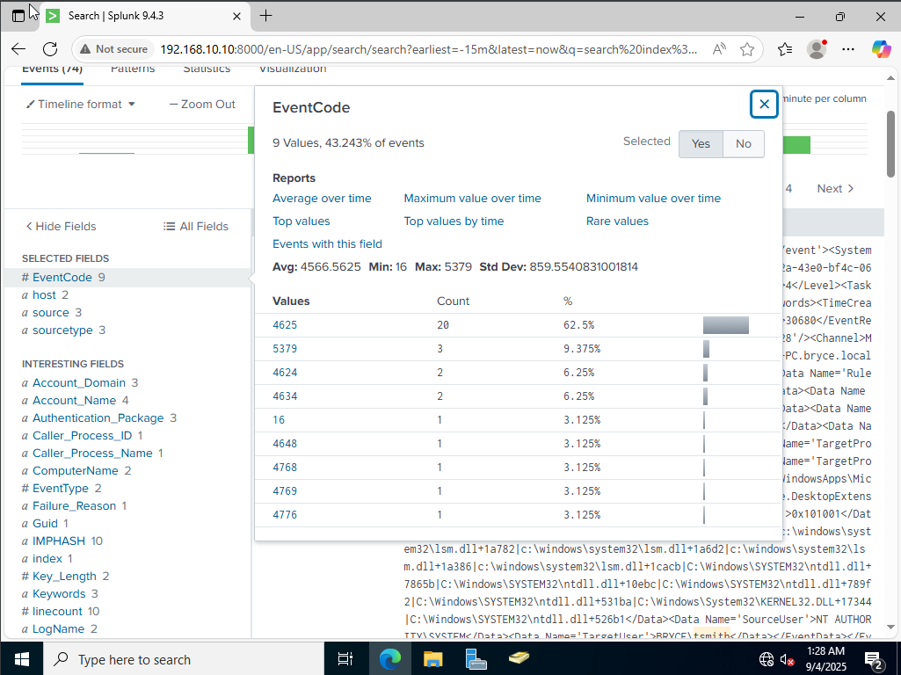

# RDP-Brute-Force-Lab

This project followed many of the steps from [MyDFIR’s Active Directory Homelab Project](https://www.youtube.com/@MyDFIR).
A hands-on lab simulating an **RDP brute-force attack** against a Windows 10 endpoint and detecting it with **Splunk Enterprise**.

---

## Environment Setup

I built a lab environment with four virtual machines in VirtualBox:

- **Kali Linux** – attacker machine  
- **Windows 10** – victim endpoint  
- **Windows Server (ADDC)** – Active Directory Domain Controller  
- **Ubuntu Server** – running Splunk Enterprise 

### Network Configuration
The VMs were configured on a NAT network with IPv4 prefix 192.168.10.0/24 and DHCP enabled. Each machine was then assigned a static IP.

## Splunk Installation & Configuration

On the Ubuntu Server, I installed Splunk Enterprise:

1.  Edited the static IP using:
    sudo nano /etc/netplan/01-static-network.yaml
    sudo netplan apply

2.  Installed Splunk via a shared folder and dpkg.

3.  Switched to the Splunk user:
    cd /opt/splunk  
    sudo -u splunk bash

4.  Started Splunk and enabled boot-start:
    ./bin/splunk start
    sudo ./bin/splunk enable boot-start -user splunk

On the Windows 10 victim machine, I installed the Splunk Universal Forwarder and configured an inputs.conf file to collect:

- Application logs
- Security logs
- System logs
- Sysmon logs

## Active Directory Setup

On the Windows Server (ADDC):
- Promoted the server to a Domain Controller.
- Created Organizational Units for HR and IT.
- Added two users:
    - James Smith (IT)
    - Terry Smith (HR)

The Windows 10 victim machine was then joined to the new domain (bryce.local) with its preferred DNS pointing to the domain controller at 192.168.10.7.

## Attack Simulation

On Kali Linux (192.168.10.250):

1. Installed Hydra.

2. Created a passwords.txt file containing the victim user’s password (P@ssword1).

3. Executed an RDP brute-force attack against user Terry Smith (tsmith) on the Windows 10 endpoint:
    hydra -t 1 -V -f -l tsmith -P passwords.txt rdp://192.168.10.100:3389

## Detection in Splunk

Splunk logs showed:
- Event ID 4625 – 20 failed login attempts (unsuccessful RDP logins).
- Event ID 4624 – 1 recent successful login from the Kali Linux attacker machine.

This confirmed that Splunk successfully detected both the brute-force attempts and the eventual compromise.